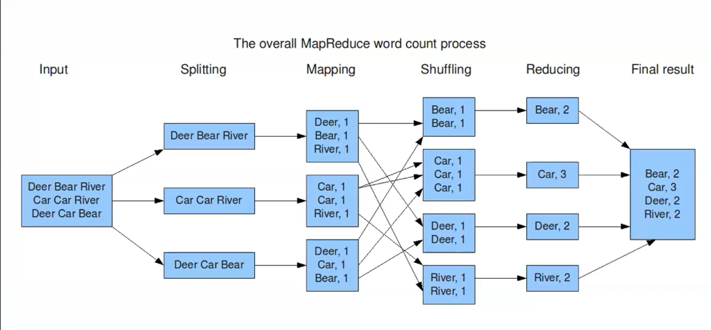

# **Intro**

$\text{Azure databricks}  = \text{Apache Spark} + \text{Databricks} + \text{Enterprise Cloud}$

- `Apache spark` := ~ engine in the background acting like a compiler or a processing unit

- `Databricks` := the platform to use spark efficiently

- `Enterprise cloud` := we can integrate Spark and Databricks with clouds such as Azure, AWS, GCP

Azure databricks is a unified set of tools for *building, deploying, sharing and maintaining* enterprise-grade data solutions at scale (Big Data Solution).

- Azure databricks is used to *process, store, share, analyze, model and monetize* their datasets with solutions from BI to ML. 

- used to build and deploy *data engineering workflows, ML models, analytics dashboards*, etc.

## Spark:

- `Apache Spark` is lightning fast cluster computing tech designed for fast computation

- it is based on `Hadoop MapReduce` and it extends the `MapReduce` model to efficiently use it for more types of computations
  
  - includes interactive queries and stream processing

- The main feature of Spark is its ***in-memory cluster computing*** that increases the processing speed of an application

# **Azure Databricks Architecture**

- We have ***control plane*** which passes commands

- We have ***compute plane*** where the actual processing takes place

## Control Plane

- Login with Azure credentials and write code our code in the ***workspace notebooks***

- ***Clusters*** is just a combination of all the hardware resources (CPUs, , memory, etc.) cumulatively used.

- ***jobs*** is just schedulers in databricks (automation)

## Compute Plane

- For running all the computation, we need physical clusters and it launches those clusters at the start.

- We will need space for running all those clusters (space as in storage so hard disk and not memory)
  
  - `rootDBFS` or `Databricks File system` is now just a data lake but beforehand used to be blob storage
  
  - the internal workspace are also using the data lake ( `rootDBFS`) such as job results, cluster logs and put notebook
  
  - uploaded files are also stored here (`rootDBFS`)

- There is ADLSgen2 or Blob Storage for customer data (separate from internal storage) which *mount* to the DBFS system
  
  - mounting helps the whole thing seemless for accessing and pushing data

- There is also ***serverless computer plane*** for computing resources for serverless SQL warehouses.

# **In-memory computation and Map-Reduce in Hadoop**

1. Each piece of datum is ***equally split*** 
   
   1. given to 1 CPU node or call it one mission

2. Then each word is ***mapped*** to its count in the split
   
   1. again each mapping block would be given to one CPU node

3.  ***Shuffle*** groups alls the similar items together

4. ***Reduce*** increases the value accordingly so, only word is needed to represent all its copies

5. Stores the ***final result***, the count dictionary 

## In memory computation

all the CPU nodes or the missions might be different but same *memory* so, `Reducing` and `Shuffling` doesn't have a large overhead -- *parallelism*

- makes Spark fast

# **Curr. Spark env VS Databricks serverless**

Main Idea:

- Current Spark environment is like cooking for people specifically, from scratch which makes it hard to scale

- Databricks serverless is like knowing how many people are coming 10 to 15 min in advance and then ordering food

Benefits:

- Optimised Spark Engine

- Native integrations with Azure and AWS

- Machine learning run time are readily available

- Notebooks available in ***Python, R, SQL (My Top 3 languages)*** and Scala

- Production ready environment with CI/CD pipelines

# **Driver Program, Worker Program and Cluster Manager**

- The `Driver program` gets and runs the code

- `Worker Nodes` are created depending on the data to be processed
  
  - `Executer` is responsible for reading the code and creating cache and tasks for it query the data and submit the results

- Cluster manager will take care of communication between `Worker nodes` and `Driver program`
  
  - how many number of records has to submit to each worker node
  
  - submittnig the piece of code to the actual worker nodes

- all nodes together is a cluster
