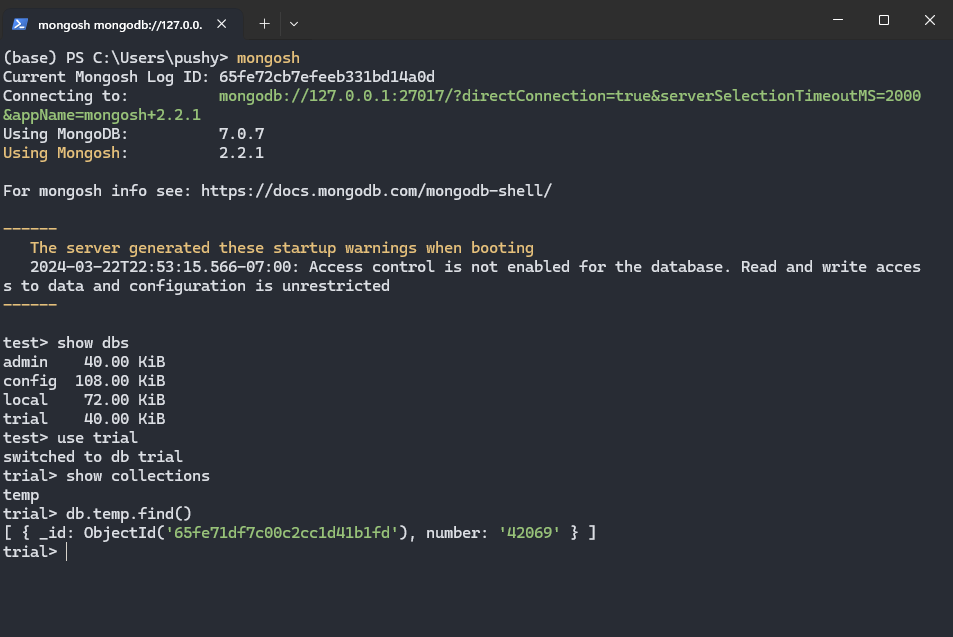

# **Goal**

The main goal of this project is to learn all the practical skills associated with the process of model deployment from data collection from a  server to deploying your model using a docker.

# **What I learned**

## Dockers

These skills and understandings are also mentioned in my Dockers notes:
1. Container architecture
2. Docker commands
3. Docker storage
4. Docker networking
5. Docker compose
6. Docker version controlling with an external registry

> All of the skills above were learnt in both theoretical (at an introductory level) and applied manner

## Model deployment 

The skillsets I learnt:
- Host your own SQL Server 
- Loading and manipulating datasets on your SQL DB server using SSMS 
- Perform SQL queries using Python (Get access to data from SQL DB)
- Use `datasist` library to perform EDA and feature engineering
  
I also learned how to create API endpoints for my model using:
- `Flask`
- `Streamlit`
<center></center>

- Using `FastAPI` to create REST APIs for prediction
<center></center>

Note: Also learned how to use `Git-LFS` because `sklearn.RandomForestRegression()` models have huge storage (_especially for trees with_ $\infty$ _depth_)

## Azure DataBricks and pySpark

I learned the following:
1. Azure Databricks architecture
2. In-memory computation and Map-Reduce in Hadoop
3. Spark environment vs Databricks serverless architecture
4. Cluster management system

Also learned how to use 
```python
pyspark
```
such as:
1. How to set up Apache spark environment 
2. Parallelising data processing with spark
3. Performing Data manipulations on `rdd` and `dataframes` in spark
4. Machine learning in spark

Combined all my knowledge from above with my past machine learning skills to actually create an ML pipeline using ***airbnb*** data to predict prices:


## MongoDataBase

### Mongoshell for data manipulations:


1. Learned how to setup a local MongoDB and cloud based MongoDB Server
2. Learned how to perform basics of CRUD on MongoDB using mongo shell commands
3. Perform more complex queries such as accessing conditional subsets, sorting, and updating schemas in the DB server


### Also used MongoDB compass to manipulate data


 # Pinecone

I learned the following aspects of using a vector database (`Pinecone`):
- What are Pinecone indexes
  
  
- How to use serverless vector databases
- Getting, upserting adn editing vectors in the databases
- Performing metadata filtering on queries

    
- How `namespaces` work in Pinecone
- Creating a `simple k-nn classifier` using the vector database

The vectors uploaded are plotted below:
    

Sample code classifying them based on $\cos$ similarity
    

Pinecone starter index is shown below:
    
